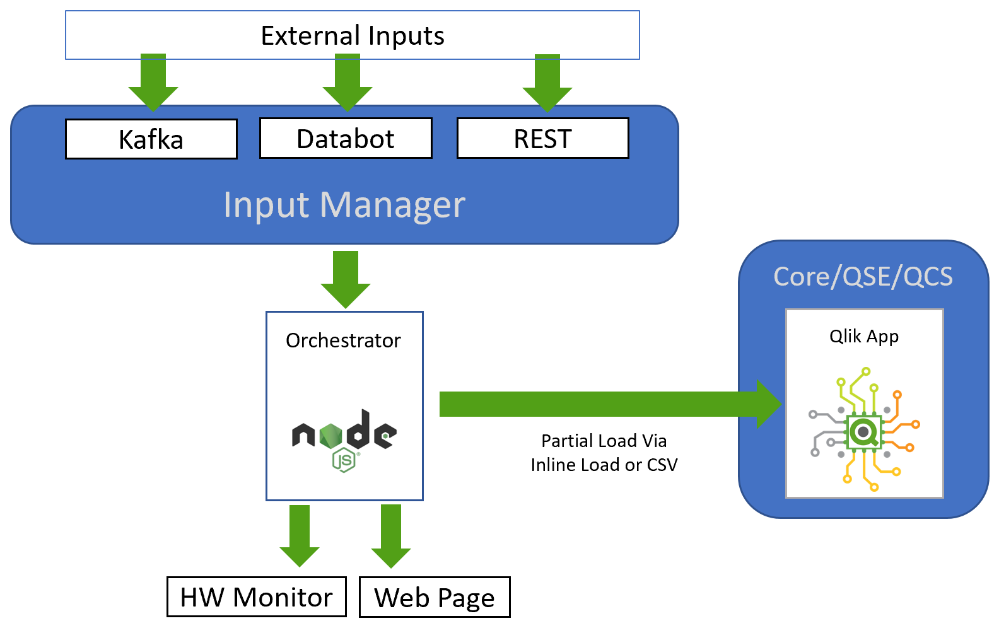
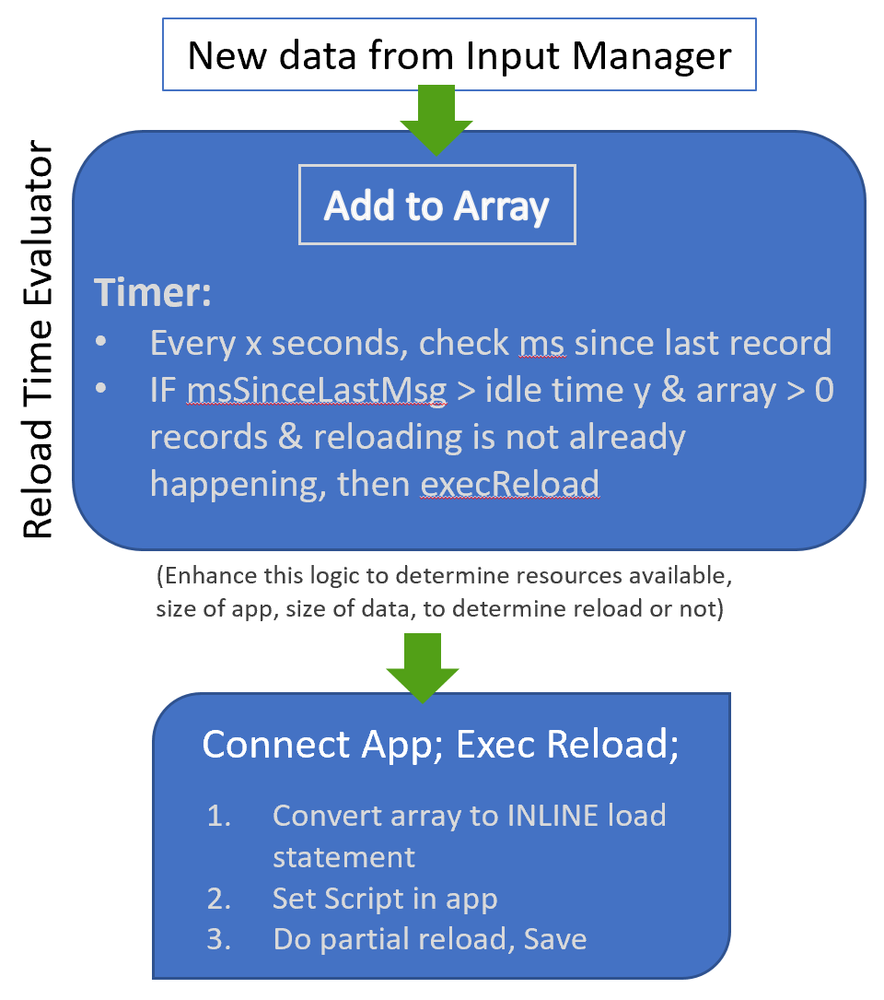

# Welcome to Qonductor

This repository contains the source code and assets for the Qonductor orchestration environment for loading data into Qlik from arbitrary streaming sources / message busses. The batching of the data is throttled according to a configurations driven by system resources and record volume/velocity and is in turn loaded into Qlik apps incrementally. 

Note that because this also fires up a Qlik Core instance for testing or use otherwise, you must accept the [Qlik Core EULA](https://core.qlik.com/eula/) by setting the `ACCEPT_EULA` environment variable.

```sh
ACCEPT_EULA=yes docker-compose up -d
```
To get this going, get on a linux box with Docker and Docker-Compose installed, git clone this repo, enter the directory, and run 
```sh
./startenv
```
This should fire up your environment and you're ready to send data in!

If you're using Kafka, set the topic and any other partition or offset configurations in [inputmgr/server.js](./inputmgr/server.js)


## Contents

- [inputmgr](./inputmgr/) - The input manager is where the primary code for the orchestration service, in server.js
- [databot](./databot/) - Databot container / microservice used for sending data into the microbatching/orchestration service
- [test](./test/) - Function tests for the examples against Qlik Core (bash scripts)
- [data](./data/) - Data that can be used to load test data into qlik core via examples

## Architecture Overview

### Input Manager: 



### Orchestrator internal:



## Contributing

Please help make this better! Please feel free to fork/pull and let me know if you have any questions or suggestions!

## Found a bug?

Found a problem with the examples? Don't hesitate to submit an issue.
