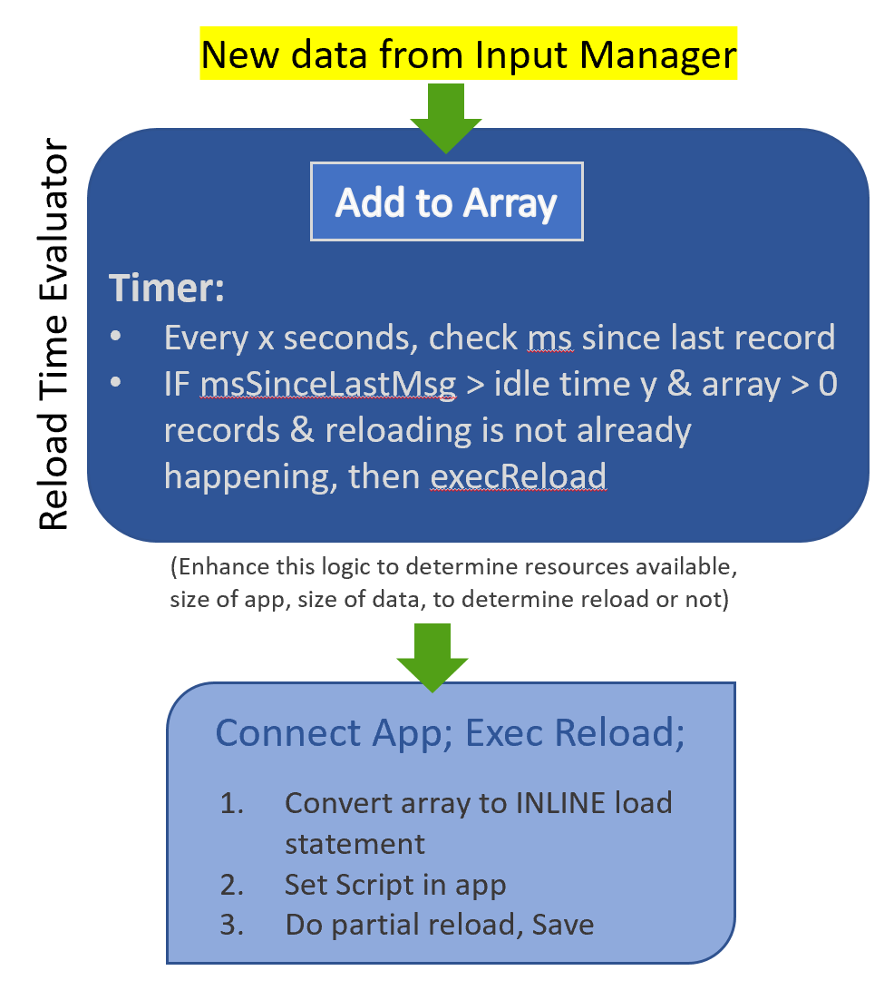

# Welcome to Qonductor

This project was created to demonstrate how data can be microbatched from external sources, co-mingled, and loaded into Qlik on an automatically controlled basis. Keeping apps as up-to-date as possible is always a desired requirement for analysts. The risk of executing reloads too frequently is that reloads on top of other reloads can corrupt apps and produce other undesired outcomes. For this reason, an *orchestration service* is required to queue and manage data appropriately in Qlik. 

# Deployment

This repository contains the source code and assets for the Qonductor orchestration environment for loading data into Qlik from arbitrary streaming sources / message busses. The batching of the data is throttled according to a configurations driven by system resources and record volume/velocity and is in turn loaded into Qlik apps incrementally. 

-----> *Requires Docker and Docker-Compose* <-----

Note that because this also fires up a Qlik Core instance for testing or use otherwise, you must accept the [Qlik Core EULA](https://core.qlik.com/eula/) by setting the `ACCEPT_EULA` environment variable.

```sh
ACCEPT_EULA=yes docker-compose up -d
```
To get this going, get on a linux box with Docker and Docker-Compose installed, git clone this repo, enter the directory, and run 
```sh
./startenv
```
This should fire up your environment and you're ready to send data in!

If you're using Kafka, set the topic and any other partition or offset configurations in [inputmgr/server.js](./inputmgr/server.js)


# Contents

- [inputmgr](./inputmgr/) - The input manager is where the primary code for the orchestration service, in server.js
- [databot](./databot/) - Databot container / microservice used for sending data into the microbatching/orchestration service
- [test](./test/) - Function tests for the examples against Qlik Core (bash scripts)
- [data](./data/) - Data that can be used to load test data into qlik core via examples

# Architecture Overview

## Input Manager: 


## Orchestrator internal:



# Future improvements envisioned

* Incremental reloads which handle deletes and updates research using partial "REPLACE" feature.

* Bounce every record to an extension for true realtime (socket.io npm has been successfully leveraged), implement realtime vis in Picasso.js

* Optionally aggregate on-the-fly

* Handle schema issues (synthetic keys, renaming columns as appopriate)

* Generation of primary key by default to enhance update syncs with source

* Bundle rows more efficiently 

* Perhaps use SSE vs inline load

* Related to above - possibly spin up other apps to shard/partition by app and have a higher level app / web ui to visualize/merge/roll up various apps at various grains.. leveraged downstream on central node and then brought back down for comparisons at the edge

# Contributing

Please help make this better! Please feel free to fork/pull and let me know if you have any questions or suggestions!

# Found a bug?

Found a problem with the examples? Don't hesitate to submit an issue.
